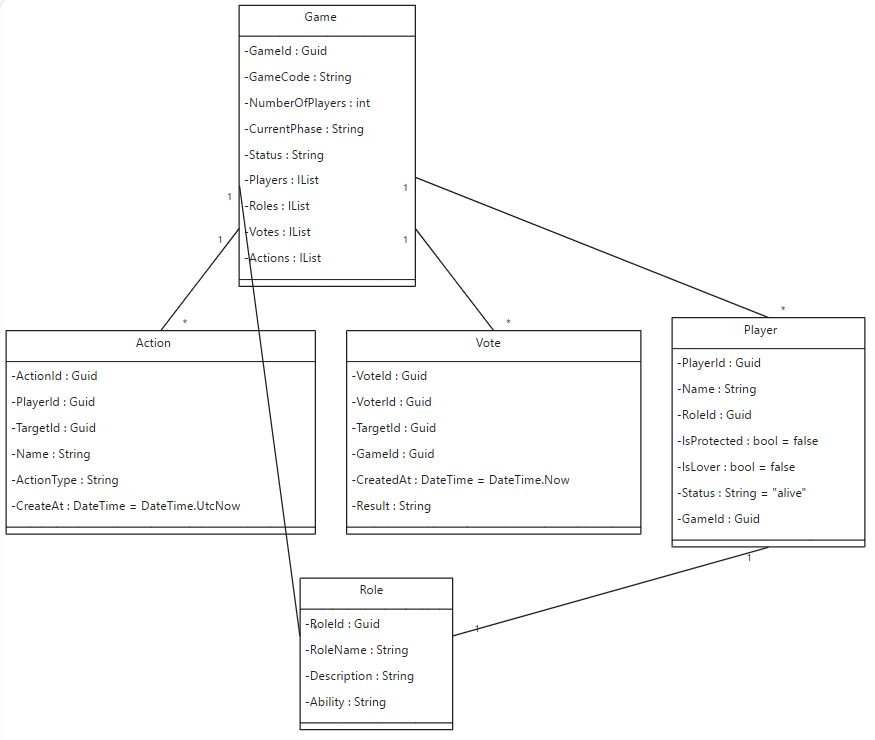

# Werewolf Role Distributor
# [Click here](https://loupgarou.netlify.app) to try the Demo

## Project Overview
Welcome to the Werewolf Role Distributor! This web application simplifies the setup and role distribution process for the popular social deduction game, Werewolf. Whether you're playing in-person or virtually, our app ensures a smooth start to your game by assigning roles efficiently and privately.
-  [Check the frontend repository](https://github.com/BenAyedMehdi/LoupGarouReact/tree/develop) 

## Project Goals
- Develop a software solution to automate game mechanics, replacing the traditional narrator.
- Enable scalable participation, with players joining from various devices.
- Automate role assignments, game state updates, and adherence to game rules.

## Key Features
- **Create New Games**: Easily set up a new game by specifying the number of players and selecting the roles you want to include.
- **Join Existing Games**: Players can join a game using a unique session code, making it easy to get everyone involved.
- **Role Assignment**: Each player receives a private notification of their assigned role.
- **User-Friendly Interface**: Our clean and intuitive UI guides you through the setup and role distribution process effortlessly.
- **Responsive Design**: Enjoy the app on both desktop and mobile devices, making it versatile for any gaming scenario.


## Database Schema
### Tables
- **Hosts**: Details about game hosts.
- **Players**: Player information, linked to game sessions and roles.
- **GameSessions**: Information about each game instance.
- **Roles**: Types of roles available in the game.
- **Actions**: Records actions taken by players.
- **Votes**: Records voting actions within game sessions.
- **GameEvents**: Captures significant events in a game session.

### Relationships
- A GameSession is created by a Host.
- Players join GameSessions and are assigned Roles.
- Actions and Votes are linked to Players and GameSessions.
- GameStates are updated based on Actions taken in a GameSession.

## Future Plans
- Implement the full narrator feature to automate the game phases.
- Add more customizable roles and game settings.
- Enhance the UI for a more immersive experience.
- Introduce user accounts and game history.


## Solution Architecture
- **Host**: Manages game creation, player roles, and broadcasts the game state.
- **Players**: Join games, take actions (vote, use special abilities), and receive game state updates.
- **Game Instance**: Allows hosts to create and manage game sessions.
- **Role Management**: Enables dynamic assignment of player roles.
- **Game State Broadcast**: Ensures all players are updated with the current game state.
- **Player Actions**: Facilitates actions like voting and special role abilities.

## Key Features
- Scalable for numerous players.
- Real-time updates for seamless gameplay.
- Customizable for different game settings and rules.

## Challenges
- Managing complex game mechanics.
- Handling a large player base efficiently.
- Customization for varied game requirements.
- Maintaining reliability and consistency in gameplay.

---

## Docker Setup
 
The full stack is orchestrated from the [LoupGarouInfra](https://github.com/Njoura7/LoupGarouInfra) repository. **You do not need to run anything inside this repo to get it running** — just make sure the folder structure below is in place and follow the instructions in `LoupGarouInfra`.
 
### Prerequisites
 
- [Docker Desktop](https://www.docker.com/products/docker-desktop/) installed and running
- This repo, [LoupGarouReact](https://github.com/BenAyedMehdi/LoupGarouReact), and [LoupGarouInfra](https://github.com/Njoura7/LoupGarouInfra) all cloned side by side:
```
projects/
├── LoupGarouAPI/       ← this repo
├── LoupGarouReact/
└── LoupGarouInfra/
```
 
### Start the full stack
 
```bash
cd LoupGarouInfra
docker compose up --build
```
 
Once all containers are green in Docker Desktop:
 
| Service | URL |
|---|---|
| API + Swagger | `http://localhost:8080` |
| Frontend | `http://localhost:3000` |
 
### Zero manual setup — migrations and seeding are fully automatic
 
> **You do not need to run any migration or database commands.** The API handles everything itself the moment it boots inside Docker.
 
On every fresh start against an empty database, the API automatically runs all pending EF Core migrations in order and seeds the required game cards into the database before accepting any requests. EF Core tracks which migrations have already been applied, so restarting the stack never re-runs them or duplicates any data. The database is always in the correct state without any developer intervention.
 
### Stopping the stack
 
```bash
docker compose down
```
 
To fully reset including all database data:
 
```bash
docker compose down -v
```